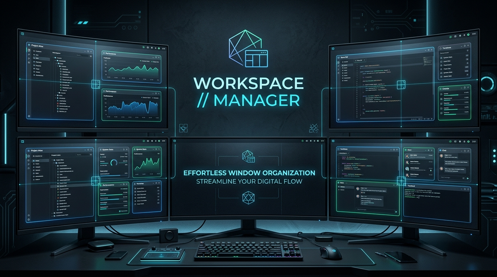
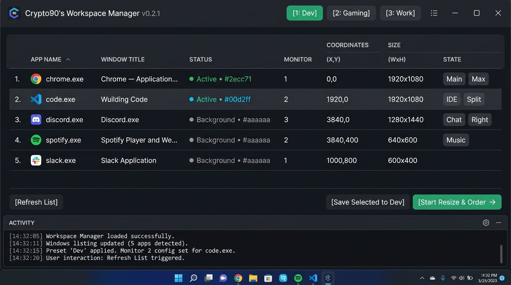
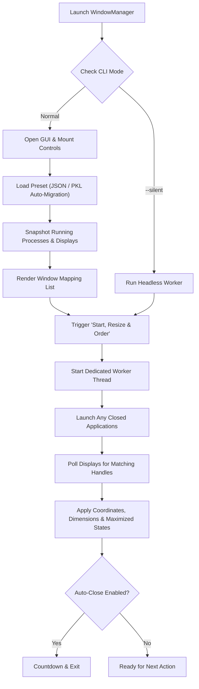

<div align="center">



# 🖥️ Crypto90's WindowManager

**Intelligent, multi-monitor window management and workspace restoration for Windows.**

[](https://github.com/Crypto90/WindowManager/releases/latest)
[](https://github.com/Crypto90/WindowManager/actions)
[](https://github.com/Crypto90/WindowManager)
[](https://www.python.org/)
[](./LICENSE)
[](https://ko-fi.com/K3K314GUP)

<p align="center">
  <a href="#-download-pre-built-executable"><b>Download Executable</b></a> •
  <a href="#-key-features"><b>Key Features</b></a> •
  <a href="#-screenshot"><b>UI Preview</b></a> •
  <a href="#-command-line-options"><b>CLI Usage</b></a> •
  <a href="#-how-it-works"><b>How It Works</b></a> •
  <a href="#-building-from-source"><b>Build Guide</b></a>
</p>

</div>

---

## 💡 Overview

**Crypto90's WindowManager** solves a universal workspace frustration: every time your PC reboots, monitors wake from sleep, or applications update, your windows scatter across screens.

With WindowManager, your ideal desktop layout is saved into distinct presets (up to 10). When triggered—either automatically on system boot or with a single click—it scans all connected displays, ensures missing applications are automatically started, and smoothly arranges every window into its exact coordinate, dimension, and state (including true maximized windows).

---

## 🚀 Download Pre-built Executable

End-users do **not** need Python installed. Standalone Windows binaries are automatically compiled via GitHub Actions:

| Version | Asset | Direct Download | Platform |
| :---: | :---: | :---: | :---: |
| **v0.2.0** *(Latest)* | `Crypto90s_WindowManager.exe` | [**⬇️ Download v0.2.0 Executable**](https://github.com/Crypto90/WindowManager/releases/download/0.2.0/Crypto90s_WindowManager.exe) | Windows 10 / 11 (64-bit) |

> 📁 Check all versions and release notes in [GitHub Releases](https://github.com/Crypto90/WindowManager/releases).

---

## ✨ Key Features

<table>
  <tr>
    <td width="50%">
      <h3>🎯 Multi-Monitor Precision</h3>
      Per-Monitor V2 High-DPI awareness prevents coordinate distortion or off-screen jumping across mixed-scaling displays (e.g. 4K at 150% + 1080p at 100%).
    </td>
    <td width="50%">
      <h3>⚡ Non-Blocking Multithreading</h3>
      Window ordering and launching run on a dedicated background worker thread with real-time timestamped logs and a responsive <b>Stop / Cancel</b> button. Zero <i>(Not Responding)</i> GUI freezes.
    </td>
  </tr>
  <tr>
    <td width="50%">
      <h3>🔄 Automatic Process Launching</h3>
      Detects closed applications saved in your preset and launches them automatically before arranging. Supports relocation detection for updated apps (e.g. Chrome, Discord).
    </td>
    <td width="50%">
      <h3>🪟 Maximized & Minimized Support</h3>
      Accurately restores true maximized (<code>SW_MAXIMIZE</code>) and minimized states without window border bleed or flicker.
    </td>
  </tr>
  <tr>
    <td width="50%">
      <h3>💾 Safe JSON Storage</h3>
      Human-readable, easily editable <code>window_states_X.json</code> format. Includes automatic, lossless migration from legacy <code>.pkl</code> files.
    </td>
    <td width="50%">
      <h3>🏷️ Custom Preset Renaming</h3>
      Personalize your presets with custom labels (e.g., <i>"1: Work / Dev"</i>, <i>"2: Gaming"</i>, <i>"3: Trading"</i>) directly through the interface.
    </td>
  </tr>
  <tr>
    <td width="50%">
      <h3>🚀 Silent / Headless CLI Mode</h3>
      Run window management silently in the background with <code>--silent</code>—perfect for Windows Task Scheduler or automated startup scripts.
    </td>
    <td width="50%">
      <h3>📦 UWP & Modern App Support</h3>
      Resolves AppUserModelId (AUMID) to reliably start Windows Store and UWP applications (e.g., Spotify, Calculator, Terminal).
    </td>
  </tr>
</table>

---

## 📸 Screenshot

<div align="center">
  
</div>

---

## ⌨️ Command Line Options

WindowManager includes a flexible command-line interface for automation and shortcuts:

```bash
# Launch GUI and load a specific preset (1-10)
python Crypto90s_WindowManager.py --preset 2

# Headless / Silent Execution (arranges windows in background and exits without GUI)
python Crypto90s_WindowManager.py --preset 1 --silent

# Display version information
python Crypto90s_WindowManager.py --version

# View all command line options
python Crypto90s_WindowManager.py --help
```

### CLI Parameter Reference

| Flag | Argument | Description |
| :--- | :--- | :--- |
| `--preset` | `1-10` | Specifies which preset to load on launch (defaults to `1`). |
| `--silent`, `--headless` | *None* | Runs ordering in the background without creating a GUI window. |
| `--version` | *None* | Displays current software version. |
| `-h`, `--help` | *None* | Prints CLI help and usage instructions. |

---

## 🔄 How It Works


```mermaid
flowchart TD
    A["Launch WindowManager"] --> B{"Check CLI Mode"}
    B -->|--silent| C["Run Headless Worker"]
    B -->|Normal| D["Open GUI & Mount Controls"]
    
    D --> E["Load Preset (JSON / PKL Auto-Migration)"]
    E --> F["Snapshot Running Processes & Displays"]
    F --> G["Render Window Mapping List"]
    
    G --> H["Trigger 'Start, Resize & Order'"]
    C --> H
    
    H --> I["Start Dedicated Worker Thread"]
    I --> J["Launch Any Closed Applications"]
    J --> K["Poll Displays for Matching Handles"]
    K --> L["Apply Coordinates, Dimensions & Maximized States"]
    L --> M{"Auto-Close Enabled?"}
    M -->|Yes| N["Countdown & Exit"]
    M -->|No| O["Ready for Next Action"]
```

---

## 🛠️ Building from Source

### Prerequisites

- **Python 3.8+** (Windows 10 or 11 recommended)
- Git

### 1. Clone Repository & Install Dependencies

```bash
git clone https://github.com/Crypto90/WindowManager.git
cd WindowManager

pip install -r requirements.txt
```

### 2. Run Locally

```bash
python Crypto90s_WindowManager.py
```

### 3. Build Standalone Executable

You can compile a standalone `.exe` using PyInstaller:

**Option A (One-Click Script on Windows):**
Double-click `build_exe.bat` in the repository root.

**Option B (Manual Command):**
```bash
pyinstaller --onefile --noconsole --name "Crypto90s_WindowManager" Crypto90s_WindowManager.py
```
The compiled binary will be located in the `dist/` directory:
```
dist/Crypto90s_WindowManager.exe
```

---

## 📁 Configuration & Preset Storage

Preset configurations are stored as clean, structured JSON files:
- Portable location: Next to the executable/script if writable (`window_states_1.json`, etc.).
- System fallback: `%LOCALAPPDATA%\Crypto90s_WindowManager\` if running from a protected directory.

### Sample Preset Entry (`window_states_1.json`):
```json
{
  "version": "v0.2.0",
  "window_states": {
    "chrome.exe": {
      "process_name": "chrome.exe",
      "window_title": "GitHub - Crypto90/WindowManager",
      "position": [0, 0],
      "size": [1920, 1080],
      "process_path": "C:\\Program Files\\Google\\Chrome\\Application\\chrome.exe",
      "minimized": false,
      "maximized": true,
      "launcher_override": null,
      "is_uwp": false,
      "uwp_app_id": null
    }
  },
  "config": {
    "auto_close": false,
    "preset_names": {
      "1": "Development & Research"
    }
  }
}
```

---

## 🤝 Contributing

Contributions, issues, and feature requests are welcome!
1. Fork the project.
2. Create your feature branch (`git checkout -b feature/amazing-feature`).
3. Commit your changes (`git commit -m 'Add amazing feature'`).
4. Push to the branch (`git push origin feature/amazing-feature`).
5. Open a Pull Request.

---

## ☕ Support the Developer

If Crypto90's WindowManager saves you time and organizes your daily workspace, consider supporting the project:

<div align="center">

[](https://ko-fi.com/crypto90)

</div>

---

## 📄 License

This project is licensed under the **Apache License 2.0**. See the [LICENSE](./LICENSE) file for details.
