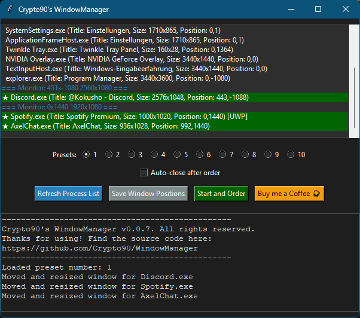

# Crypto90's WindowManager
This is a simple desktop application built using tkinter that allows users to manage the positions and states of application windows on their system. The program uses psutil, pygetwindow, and win32gui libraries to interact with the system's windows, allowing you to save and restore the positions of running applications across different monitors. Additionally, it ensures that not running processes get started automatically.

# Start parameters (optional):
`--preset 1-10` Automatically starts the program with the given preset number.

# Download prebuild executable:
[Download v0.0.7](https://github.com/Crypto90/WindowManager/releases/download/0.0.7/Crypto90s_WindowManager.exe)

# Screenshot:

# Features:

#### Window State Management:

Saves and restores the position and size of windows for various processes.

#### Multi-Monitor Support:

Identifies the monitor on which each window is displayed and groups windows accordingly.

#### Process Monitoring:

Ensures processes are running and restarts them if they are not active.

#### Automatic Process Start:

If a window’s associated process is not running, the program automatically attempts to start it.

#### Log Output:

Displays detailed logs, including errors and success messages, with a clean and readable output.

#### Process List:

Displays a list of currently running processes with their window titles and statuses (running or not).

#### Save and Restore:

Allows users to save window positions and restore them later, ensuring a consistent workspace layout.

#### Window Position Adjustment:

Lets users reorder, move, and resize application windows directly through the app interface.

#### Preset Management:

Manage up to 10 seperate presets for your all your different workspace needs.

#### Auto Close Program:

If enabled, the program automatically closes itself after start and order action finishes.

# Requires
pip install psutil

pip install pygetwindow

pip install screeninfo

pip install pywin32

pip install win32gui

# Build executable
pyinstaller --onefile --noconsole Crypto90s_WindowManager.py
